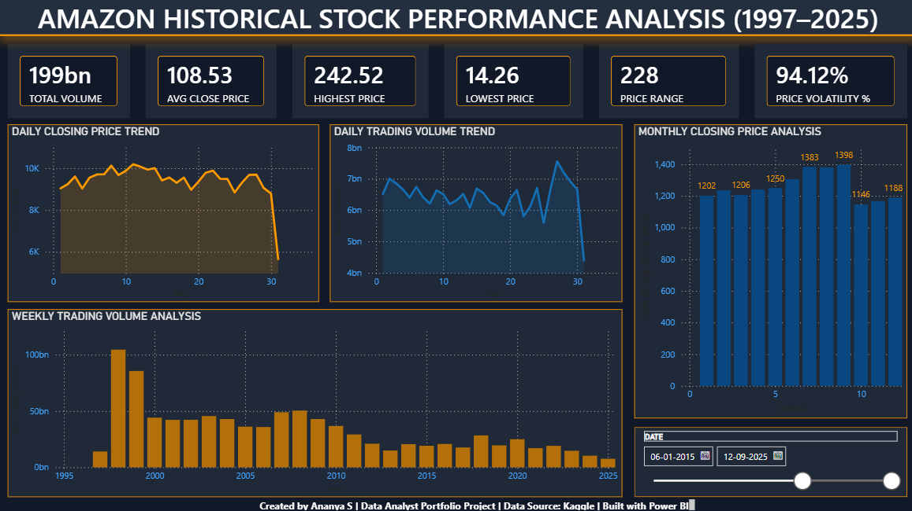

# 📈 AMAZON HISTORICAL STOCK PERFORMANCE ANALYSIS (1997–2025)

## 📌 Project Overview

This project presents an interactive Power BI dashboard designed to analyze Amazon's historical stock performance from 1997 to 2025. The dashboard transforms raw stock market data into meaningful insights through KPI reporting, trend analysis, and interactive visualizations.

The objective is to provide a comprehensive view of Amazon's stock price movements, trading volume patterns, and market volatility to support data-driven decision-making.

---

## 🎯 Business Objective

Investors and analysts often need a clear understanding of stock market behavior to evaluate performance and identify trends.

This dashboard helps users:

- Analyze long-term stock price performance
- Monitor trading volume patterns
- Measure stock price volatility
- Track key performance indicators (KPIs)
- Explore trends across daily, weekly, and monthly time periods

---

## 📊 Dataset Information

**Source:** Kaggle

The dataset includes:

- Date
- Open Price
- High Price
- Low Price
- Close Price
- Trading Volume

**Analysis Period:** 1997–2025

---

## 🛠️ Tools & Technologies

- Power BI
- Power Query
- DAX (Data Analysis Expressions)
- Data Modeling
- Data Visualization
- Business Intelligence Reporting

---

## 📈 Dashboard KPIs

| KPI | Description |
|------|-------------|
| Total Volume | Total trading volume across the dataset |
| Avg Close Price | Average stock closing price |
| Highest Price | Maximum stock price recorded |
| Lowest Price | Minimum stock price recorded |
| Price Range | Difference between highest and lowest stock price |
| Price Volatility % | Percentage variation between highest and lowest prices |

---

## 📉 Dashboard Features

### Daily Closing Price Trend
Visualizes daily stock price movements over time.

### Daily Trading Volume Trend
Tracks fluctuations in trading activity and market participation.

### Weekly Trading Volume Analysis
Provides insights into trading volume patterns aggregated at the weekly level.

### Monthly Closing Price Analysis
Highlights monthly average closing prices to identify long-term trends.

### Interactive Date Filtering
Allows users to dynamically explore stock performance across different time periods.

---

## 🧮 DAX Measures

### Price Range

```DAX
Price Range =
MAX(gold_daily_summary[high]) -
MIN(gold_daily_summary[low])
```

### Price Volatility %

```DAX
Price Volatility % =
DIVIDE(
    MAX(gold_daily_summary[high]) -
    MIN(gold_daily_summary[low]),
    MAX(gold_daily_summary[high])
)
```

---

## 🔍 Key Insights

- Amazon's stock price exhibited substantial long-term growth during the analysis period.
- Trading volume patterns reflected significant market events and investor activity.
- Monthly closing price trends highlighted periods of strong market performance.
- Volatility analysis helped identify periods of increased market uncertainty.
- KPI reporting enabled quick assessment of overall stock performance.

---

## 🖼️ Dashboard Preview

### Amazon Historical Stock Performance Dashboard



---

## 💡 Skills Demonstrated

- Data Cleaning
- Data Transformation
- Data Modeling
- DAX Development
- KPI Development
- KPI Reporting
- Dashboard Development
- Business Intelligence Reporting
- Data Visualization
- Statistical Analysis
- Trend Analysis
- Financial Data Analysis

---

## 🚀 Project Outcomes

- Built a professional Business Intelligence dashboard using Power BI.
- Developed custom DAX measures for performance tracking.
- Created interactive visualizations for stock market analysis.
- Applied data storytelling techniques to communicate insights effectively.
- Strengthened skills in data analytics, reporting, and dashboard design.

---

## 👩‍💻 Author

**Ananya S**

Aspiring Data Analyst

📧 ananya03ann@gmail.com

🔗 LinkedIn: https://www.linkedin.com/in/ananyas03

🔗 GitHub: https://github.com/ananya03ann

